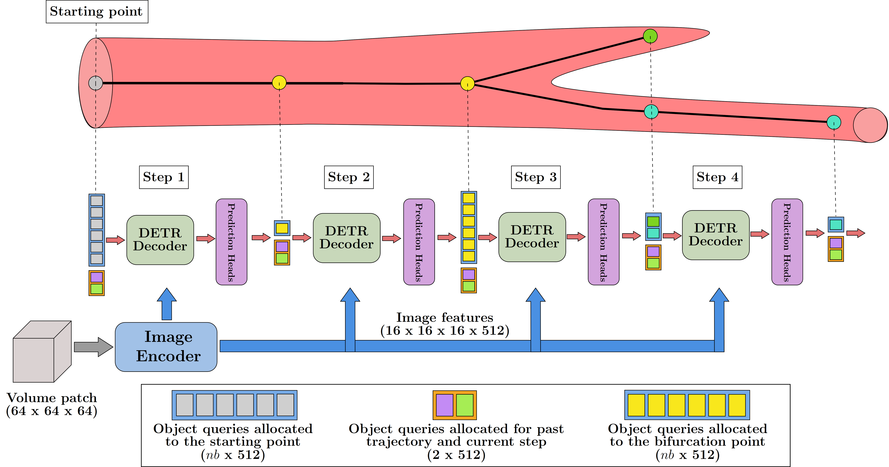

# Trexplorer: Recurrent DETR for Topologically Correct Tree Centerline Tracking

This repository provides the official implementation of the [Trexplorer: Recurrent DETR for Topologically Correct Tree Centerline Tracking](https://github.com/RomStriker/Trexplorer) paper by [Roman Naeem](https://research.chalmers.se/en/person/nroman), [David Hagerman](https://research.chalmers.se/en/person/olzond), [Lennart Svensson](https://research.chalmers.se/person/pale) and [Fredrik Kahl](https://www.chalmers.se/personer/kahlf/). The codebase builds upon [DETR](https://github.com/facebookresearch/detr) and [Trackformer](https://github.com/timmeinhardt/trackformer).

<!-- **As the paper is still under submission this repository will continuously be updated and might at times not reflect the current state of the [arXiv paper](https://arxiv.org/abs/2012.01866).** -->

<div align="center">
    
</div>

## Abstract

Tubular structures with tree topology such as blood vessels, lung airways, and more are abundant in human anatomy. Tracking these structures with correct topology is crucial for many downstream tasks that help in early detection of conditions such as vascular and pulmonary diseases. Current methods for centerline tracking suffer from predicting topologically incorrect centerlines and complex model pipelines. To mitigate these issues we propose Trexplorer, a recurrent DETR based model that tracks topologically correct centerlines of tubular tree objects in 3D volumes using a simple model pipeline. We demonstrate the model's performance on a publicly available synthetic vessel centerline dataset and show that our model outperforms the state-of-the-art on centerline topology and graph-related metrics, and performs well on detection metrics.

## Installation

## Training

## Evaluation

## Publication
If you use this software in your research, please cite our publication:

```
@article{,
  title={Trexplorer: Recurrent DETR for Topologically Correct Tree Centerline Tracking},
  author={Roman Naeem, David Hagerman, Lennart Svensson and Fredrik Kahl},
  journal={Lecture Notes in Computer Science, Medical Image Computing and Computer-Assisted Intervention – MICCAI 2024},
  year={2024},
  volume={},
  number={},
  pages={},
  doi={}
}
```